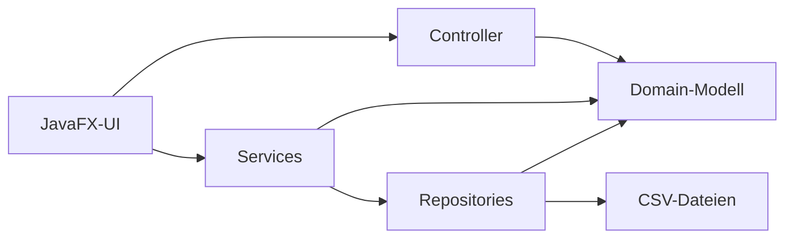

# Arena-Ticketsystem

Eine JavaFX-Desktopanwendung zur Auswahl, Buchung und Verwaltung von Tickets für unterschiedliche Veranstaltungen und Saalpläne.

Das Projekt entstand im Rahmen des Moduls **Objektorientierte Programmierung**. Im Mittelpunkt stehen ein objektorientiertes Domänenmodell, eine mehrschichtige Architektur und ein durchgängiger Buchungsprozess von der Eventauswahl bis zum digitalen Ticket.

## Funktionsumfang

### Kundenbereich

- Veranstaltungen in einer übersichtlichen Kartenansicht auswählen
- Grafische Saalpläne für Arena-, Sitzplatz- und Stehplatzveranstaltungen anzeigen
- Konkrete Sitzplätze oder eine Anzahl von Stehplatztickets auswählen
- Bis zu zehn Tickets gleichzeitig im Warenkorb verwalten
- Kundengruppen und Rabatte pro Ticket auswählen
- Benutzerkonten registrieren und sicher anmelden
- Buchungen abschließen und Quittungen anzeigen
- Eigene Tickets ansehen und stornieren
- Quittungen und die Tickets einer Bestellung als PNG-Datei speichern

### Mitarbeiterbereich

- Gesonderte Mitarbeiteranmeldung
- Veranstaltungen anlegen
- Bestehende Veranstaltungen bearbeiten
- Veranstaltungen nach Bestätigung löschen
- Eventtyp, Saalplantyp, Termin, Beschreibung und Basispreis verwalten

## Technologien

- **Java 21**
- **JavaFX 17.0.19** für die grafische Benutzeroberfläche
- **jBCrypt 0.4** für das Hashen und Prüfen von Passwörtern
- **CSV-Dateien** für die lokale Datenspeicherung
- **VS Code** mit Java-Erweiterungen als vorkonfigurierte Entwicklungsumgebung
- **Git und GitHub** für Versionsverwaltung und Zusammenarbeit

JavaFX und jBCrypt sind bereits im Verzeichnis `lib/` enthalten. Für die vorhandene Windows-Konfiguration müssen sie daher nicht zusätzlich heruntergeladen werden.

## Architektur

Die Anwendung ist in mehrere Schichten unterteilt:



- `domain`: Fachobjekte wie `Event`, `Section`, `Seat`, `Ticket`, `User` und `Receipt`
- `service`: Geschäftslogik für Buchungen, Preise, Stornierungen und Passwörter
- `repository`: Laden und Speichern der Anwendungsdaten
- `controller`: Steuerung der interaktiven Sitzplatzauswahl
- `ui`: JavaFX-Anwendung, Navigation, Screens und Dialoge

Die Benutzeroberfläche verwendet zusätzlich folgende Struktur:

- `App` startet die Anwendung, hält den gemeinsamen Buchungszustand und verbindet die Schichten.
- `ScreenManager` verwaltet die Navigation zwischen den Ansichten.
- `BaseScreen` stellt wiederverwendbare Layout- und Gestaltungselemente bereit.
- Die konkreten Screenklassen erzeugen die einzelnen Ansichten und verarbeiten Benutzereingaben.

## Projektstruktur

```text
OOPProjekt/
├── .vscode/                 Start- und Projekteinstellungen für VS Code
├── data/                    Lokale CSV-Daten
├── lib/                     JavaFX SDK und jBCrypt
├── src/
│   ├── controller/          Controller der Sitzplatzauswahl
│   ├── domain/              Domänenklassen und Hallenlayout
│   ├── exceptions/          Fachliche Exceptions
│   ├── repository/          Datenzugriff und CSV-Persistenz
│   ├── service/             Geschäfts- und Sicherheitslogik
│   └── ui/                  JavaFX-Screens, Dialoge und Navigation
└── README.md
```

## Voraussetzungen

- Git
- JDK 21
- Visual Studio Code
- Empfohlen: [Extension Pack for Java](https://marketplace.visualstudio.com/items?itemName=vscjava.vscode-java-pack)

Die im Repository enthaltene JavaFX-Ausführung ist für Windows vorbereitet. Unter Linux oder macOS muss das Verzeichnis `lib/javafx-sdk` durch ein JavaFX SDK für das jeweilige Betriebssystem ersetzt und die Startkonfiguration entsprechend angepasst werden.

## Installation und Start

1. Repository klonen:

   ```bash
   git clone https://github.com/hayatvaneck/Eventarena-Ticket-Verkauf-System.git
   ```

2. Projektordner öffnen:

   ```bash
   cd Eventarena-Ticket-Verkauf-System
   code .
   ```

3. Falls VS Code danach fragt, die empfohlenen Java-Erweiterungen installieren und das Laden des Java-Projekts abwarten.

4. In VS Code den Bereich **Run and Debug** öffnen.

5. Die vorhandene Startkonfiguration **Launch Arena App** auswählen und mit `F5` starten.

Die Anwendung muss mit dem Projektverzeichnis als Arbeitsverzeichnis gestartet werden, da die CSV-Dateien über relative Pfade aus `data/` geladen werden.

## Demo-Zugänge

Für die Demonstration werden bei Bedarf automatisch Testkonten angelegt:

| Bereich | Benutzername/E-Mail | Passwort |
| --- | --- | --- |
| Kundenkonto | `max@mustermann.de` | `passwort` |
| Mitarbeiterkonto | `admin` | `admin` |

> **Hinweis:** Diese Zugangsdaten sind ausschließlich für die lokale Demonstration vorgesehen und dürfen nicht in einer produktiven Anwendung verwendet werden.

## Benutzerhandbuch

### 1. Anwendung starten

Nach dem Start öffnet sich das Hauptmenü mit den verfügbaren Veranstaltungen. Die Anwendung kann zunächst als Gast genutzt werden. Eine Anmeldung ist spätestens beim kostenpflichtigen Abschluss einer Buchung erforderlich.

### 2. Veranstaltung auswählen

1. Im Hauptmenü die gewünschte Veranstaltung anklicken.
2. Die ausgewählte Eventkarte wird optisch hervorgehoben.
3. Auf **Blöcke anzeigen** klicken. Alternativ kann die Eventkarte doppelt angeklickt werden.
4. Ohne ausgewähltes Event verhindert die Anwendung die Navigation und zeigt einen Hinweis an.

### 3. Bereich im Saalplan auswählen

Der dargestellte Saalplan richtet sich nach der Veranstaltung. Unterstützt werden:

- Arena mit Spielfeld und umliegenden Sitzblöcken
- Bühne mit bestuhltem Innenraum
- Bühne mit Stehplatz-Innenraum

Jeder buchbare Bereich zeigt seinen Namen und den Preis vor einem möglichen Kundenrabatt. Eine Legende erklärt die Farben der Bereiche. Bühne und Spielfeld dienen nur der räumlichen Orientierung und können nicht gebucht werden.

Nach einem Klick auf einen Bereich öffnet sich entweder die Sitzplatz- oder Stehplatzauswahl.

### 4. Sitzplätze auswählen

Im Sitzplan gelten folgende Farben:

| Farbe | Bedeutung |
| --- | --- |
| Dunkelblau | frei und auswählbar |
| Gold | aktuell ausgewählt |
| Gelb | bereits im Warenkorb |
| Rot | bereits verkauft |

1. Einen oder mehrere freie Sitzplätze anklicken.
2. Ein erneuter Klick hebt die Auswahl wieder auf.
3. Die ausgewählten Reihen und Platznummern werden unterhalb des Plans angezeigt.
4. Mit **Sitzplatz bestätigen** werden die ausgewählten Plätze in den Warenkorb übernommen.

Es können insgesamt höchstens zehn Tickets gleichzeitig in den Warenkorb gelegt werden.

### 5. Stehplätze auswählen

Bei einem Stehplatzbereich wird keine konkrete Position ausgewählt:

1. Mit dem Zahlenfeld die gewünschte Anzahl festlegen.
2. Die auswählbare Höchstzahl berücksichtigt bereits vorhandene Warenkorbeinträge.
3. Mit **Auswahl bestätigen** werden die Tickets in den Warenkorb übernommen.

Die tatsächliche Verfügbarkeit wird beim Abschluss der Buchung erneut geprüft.

### 6. Warenkorb bearbeiten

Der Warenkorb zeigt Event, Bereich beziehungsweise Sitzplatz und den aktuellen Preis jedes Tickets.

Für jedes Ticket kann eine Kundengruppe gewählt werden:

| Kundengruppe | Rabatt |
| --- | ---: |
| Standard | 0 % |
| Student | 20 % |
| Rentner/Senior | 30 % |
| Kind | 50 % |

Der angezeigte Preis wird nach der Auswahl automatisch aktualisiert. Über den roten `X`-Button kann ein Eintrag entfernt werden. Mit **Weitere Tickets hinzufügen** geht es zurück zur Event- oder Bereichsauswahl.

Mit **Jetzt kostenpflichtig buchen** wird der Checkout gestartet. Ist noch kein Benutzer angemeldet, leitet die Anwendung zunächst zum Login weiter und setzt den Buchungsprozess danach fort.

### 7. Anmelden oder registrieren

#### Anmelden

1. E-Mail-Adresse und Passwort eingeben.
2. Auf **Einloggen** klicken oder die Enter-Taste drücken.
3. Bei gültigen Daten wird die zuvor begonnene Aktion fortgesetzt.

#### Registrieren

Über **Noch kein Konto? Hier registrieren** kann ein neues Konto erstellt werden. Erforderlich sind Vorname, Nachname, E-Mail-Adresse, Passwort und Passwortbestätigung.

Das Passwort muss:

- mindestens acht Zeichen lang sein,
- einen Großbuchstaben enthalten,
- einen Kleinbuchstaben enthalten,
- mindestens eine Zahl enthalten und
- mindestens ein Sonderzeichen enthalten.

Zusätzlich prüft die Anwendung das E-Mail-Format, die Übereinstimmung beider Passwörter und ob die E-Mail-Adresse bereits registriert ist. Das Passwort wird nur als BCrypt-Hash gespeichert.

Nach erfolgreicher Registrierung ist der neue Benutzer automatisch angemeldet. Befinden sich bereits Tickets im Warenkorb, führt die Anwendung dorthin zurück; andernfalls öffnet sich das Hauptmenü.

### 8. Buchung abschließen

Nach erfolgreicher Anmeldung werden die ausgewählten Plätze verbindlich gebucht und die Tickets gespeichert. Die Bestätigungsseite zeigt alle gerade erzeugten Tickets mit Event, Termin, Bereich, Platz, Kundengruppe und Endpreis.

Von dort stehen folgende Aktionen zur Verfügung:

- **Ticket öffnen:** Detailansicht eines Tickets anzeigen
- **Quittung öffnen:** Quittung der aktuellen Buchung anzeigen
- **Meine Tickets:** zur persönlichen Ticketübersicht wechseln
- **Zum Hauptmenü:** einen neuen Vorgang beginnen

### 9. Eigene Bestellungen und Tickets verwalten

Angemeldete Benutzer erreichen die Übersicht über **Meine Tickets** im Hauptmenü. Die aktiven Tickets werden nach Bestellung und zugehöriger Quittung gruppiert; die neuesten Bestellungen stehen oben.

Für jede Bestellung sind folgende Aktionen verfügbar:

- Quittung als PNG-Datei speichern
- alle noch aktiven Tickets der Bestellung gemeinsam als PNG-Datei speichern
- einzelne Tickets nach Bestätigung stornieren

Beim Export öffnet sich ein Dateidialog zur Auswahl des Zielorts. Wurden alle Tickets einer Bestellung storniert, wird diese nicht mehr in der Liste der aktiven Bestellungen angezeigt.

Bei einer erfolgreichen Stornierung wird der Sitzplatz oder die entsprechende Stehplatzkapazität wieder freigegeben und das Ticket aus dem lokalen Datenbestand entfernt.

### 10. Quittungen anzeigen

Die Anwendung speichert zu jeder abgeschlossenen Buchung eine Quittung. Diese enthält Quittungsnummer, Benutzer, Zeitpunkt, Gesamtbetrag und die zugehörigen Ticket-IDs. Die zuletzt erzeugte Quittung kann direkt auf der Bestätigungsseite geöffnet werden. Ältere Quittungen bilden in **Meine Tickets** jeweils den Kopf der zugehörigen Bestellung und können dort als PNG exportiert werden.

### 11. Mitarbeiterbereich verwenden

1. Im Kundenlogin auf **Mitarbeiter? Hier Einloggen** klicken.
2. Mitarbeitername und Passwort eingeben.
3. Nach erfolgreicher Anmeldung öffnet sich die Eventverwaltung.

#### Veranstaltung anlegen

Folgende Felder ausfüllen:

- Eventtitel
- Beschreibung mit höchstens 600 Zeichen
- Eventtyp
- Saalplantyp
- Datum im Format `TT.MM.JJJJ`
- Uhrzeit im Format `HH:mm`
- Basispreis, beispielsweise `50,00` oder `50.00`

Anschließend auf **Event speichern** klicken.

Termine in der Vergangenheit werden abgelehnt.

#### Veranstaltung bearbeiten

1. Beim gewünschten Event auf **Bearbeiten** klicken.
2. Die bestehenden Daten werden in das Formular übernommen.
3. Werte ändern und mit **Änderungen speichern** bestätigen.
4. Mit **Bearbeiten abbrechen** kann der Vorgang verworfen werden.

#### Veranstaltung löschen

1. Beim gewünschten Event auf **Löschen** klicken.
2. Den Sicherheitsdialog prüfen.
3. Das endgültige Löschen bestätigen oder abbrechen.

## Datenspeicherung

Die Anwendung verwendet lokale CSV-Dateien im Verzeichnis `data/`:

| Datei | Inhalt |
| --- | --- |
| `events.csv` | Veranstaltungen |
| `tickets.csv` | gebuchte Tickets |
| `receipts.csv` | Quittungen |
| `users.csv` | Kundenkonten und Passwort-Hashes |
| `employees.csv` | Mitarbeiterkonten und Passwort-Hashes |

Die Daten bleiben auf dem jeweiligen Rechner und werden nicht an einen externen Server übertragen. Die Anwendung sollte stets aus dem Projektverzeichnis gestartet werden, damit diese Dateien gefunden werden.

## Bekannte Einschränkungen

- Die Anwendung ist derzeit ausschließlich deutschsprachig.
- Erweiterte Barrierefreiheitsfunktionen wie Hochkontrastmodus oder Screenreader-Texte sind noch nicht umgesetzt.
- Es handelt sich um eine lokale Desktopanwendung ohne echte Zahlungsanbindung.
- Die CSV-Persistenz ist nicht für parallele Zugriffe mehrerer Benutzer ausgelegt.
- Beim Programmstart werden Events aktuell aus `EventDemoData` initialisiert und mit `events.csv` synchronisiert. Änderungen aus dem Mitarbeiterbereich stehen daher während der laufenden Sitzung zur Verfügung, werden beim nächsten Start aber wieder durch die Demodaten ersetzt.
- Das gebündelte JavaFX SDK ist für Windows vorgesehen.

## Team

Entwickelt von:

- Lukas Beck
- Maren Bohlig
- Gian-Luca Levels
- Hayat van Eck

## Projektstatus

Das Projekt ist ein Semesterprojekt zur Demonstration objektorientierter Modellierung, mehrschichtiger Architektur, JavaFX-basierter GUI-Entwicklung und lokaler Datenpersistenz.
